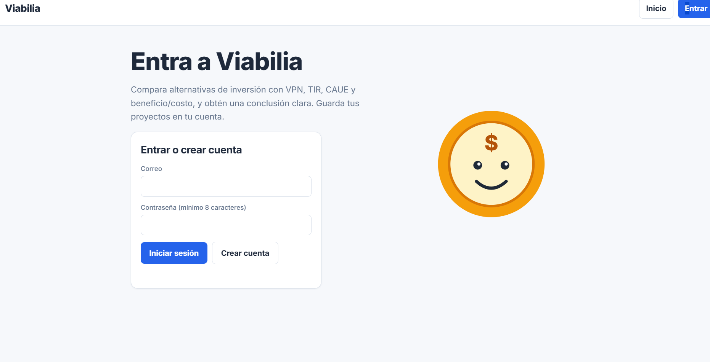
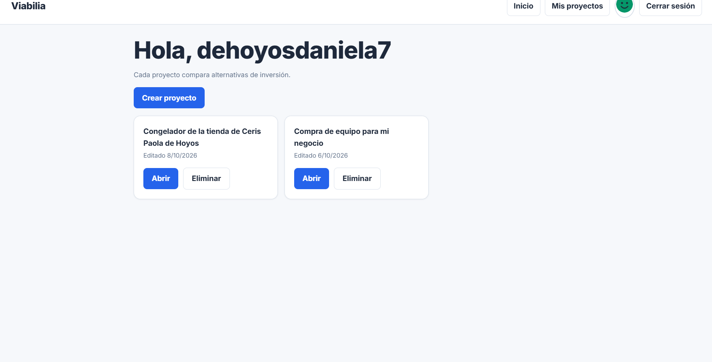
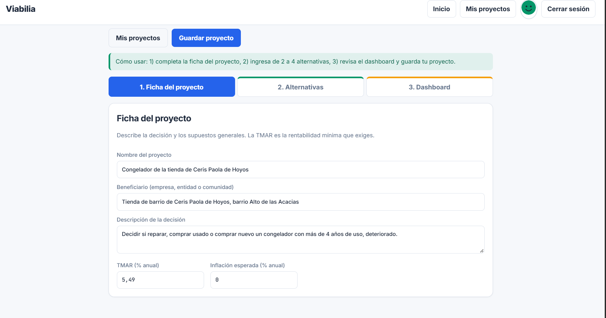
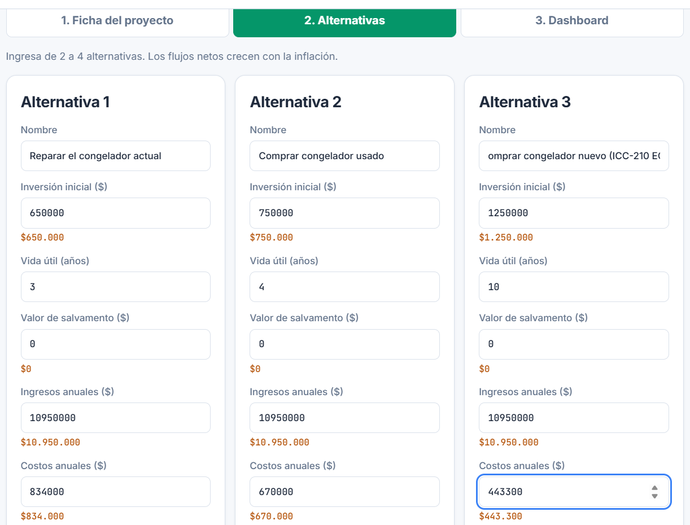
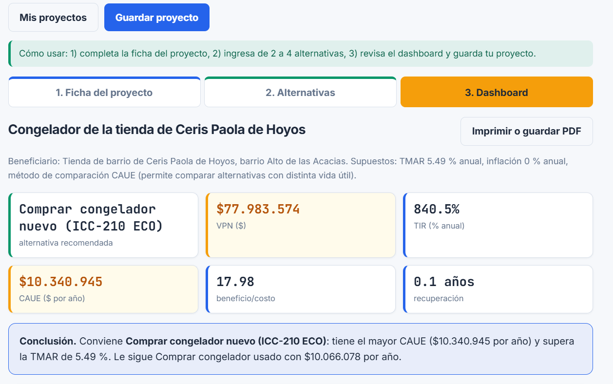

# Manual de usuario

Aplicación: https://viabilia-three.vercel.app

Este manual sigue el flujo principal: **cargar datos, comparar alternativas, ver resultados y decidir**.

## 1. Crear cuenta o iniciar sesión
1. Abre el enlace de la aplicación.
2. Escribe tu correo y una contraseña de mínimo 8 caracteres.
3. Dale a **Crear cuenta** si es tu primera vez, o a **Iniciar sesión** si ya tienes una.

Si algo falla, debajo del formulario aparece un mensaje en rojo que dice qué corregir.

## 2. Tu lista de proyectos
Al entrar ves tus proyectos guardados. Desde aquí puedes **Crear proyecto**, **Abrir** o **Eliminar** uno. Tocando tu avatar arriba a la derecha entras a tu perfil y eliges otro.

## 3. Ficha del proyecto
Completa el nombre, el beneficiario (empresa, entidad o comunidad), la descripción de la decisión, la **TMAR** (la rentabilidad mínima anual que exiges) y la **inflación** esperada.

## 4. Alternativas
Ingresa de 2 a 4 alternativas. Para cada una escribe:
- Nombre.
- Inversión inicial ($).
- Vida útil (años).
- Valor de salvamento ($), lo que recuperas al final.
- Ingresos anuales ($) y costos anuales ($).

Debajo de cada valor en pesos aparece el monto con formato (por ejemplo `$60.000.000`) para que verifiques que no sobran ceros. Con **Agregar alternativa** y **Quitar** cambias la cantidad.

## 5. Dashboard: cómo leer el resultado
- **Tarjetas de arriba:** alternativa recomendada, VPN ($), TIR (% anual), CAUE ($ por año), beneficio/costo y recuperación (años).
- **Conclusión:** una frase que dice cuál conviene y por qué, o si ninguna supera la TMAR.
- **Gráficas de barras:** comparan las alternativas por CAUE y por VPN. Una barra roja indica un valor negativo.
- **Comparación detallada:** tabla con todos los indicadores de cada alternativa.
- **Sensibilidad a la TMAR:** muestra si la mejor alternativa cambia cuando la TMAR sube o baja 3 puntos.
- **¿De dónde salen los números?:** panel con las fórmulas y los supuestos.

## 6. Guardar, imprimir y volver
- **Guardar proyecto:** aparece "Guardado ✓". Puedes abrirlo después desde **Mis proyectos**.
- **Imprimir o guardar PDF:** genera una versión clara del dashboard para anexar a un informe.

## 7. Mensajes de error frecuentes
| Mensaje | Qué hacer |
|---|---|
| Escribe un correo válido y una contraseña de mínimo 8 caracteres | Revisa el correo y alarga la contraseña |
| Ese correo ya está registrado | Usa **Iniciar sesión** |
| Correo o contraseña incorrectos | Verifica los datos o crea una cuenta |
| Falta completar datos para ver el dashboard | Lee la lista roja: indica qué campo corregir y en qué pestaña |
| Inicia sesión para continuar | La sesión venció; vuelve a entrar |

## Capturas que debes tomar con el caso real
Reemplaza los archivos de la carpeta `docs/img/`:
- `01-acceso.png`, `02-proyectos.png`, `03-ficha.png`, `04-alternativas.png` y `05-dashboard.png`.
